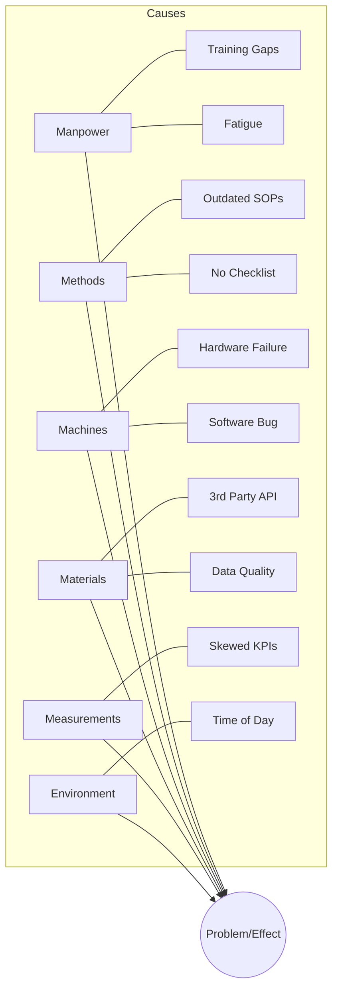

# SKILL: Root Cause Analysis (RCA) Selection & Execution

The **5 Whys** is your default for linear problems, but complex failures require heavier tools. Don't waste time digging one hole with a shovel when you need a map of the entire graveyard.

---

## 1. Tool Selection Logic
Categorize the failure immediately to avoid "analysis paralysis":

* **Linear/Simple:** Single point of failure, clear chain of events. (**5 Whys**)
* **Multi-Factorial:** "Death by a thousand cuts" or cross-departmental failures. (**Fishbone**)
* **High-Stakes/Technical:** High cost of failure, safety risks, or preventative modeling. (**FMEA**)

---

## 2. The 5 Whys (Linear Path)
**Goal:** Trace a single thread to a systemic failure.

1.  **Define the Problem Statement:** Use the **5W1H** (Who, What, Where, When, Why, How). 
    * *Example:* "The Production API in US-East-1 returned 500 errors to 15% of users between 09:00 and 09:12 UTC."
2.  **The Iterative Ask:** Use the answer of `Why(n)` as the subject of `Why(n+1)`.
3.  **The "So What?" Test:** If a "Why" doesn't lead to a controllable process, discard it.
4.  **The Stop Condition:** You are finished when the cause is a **process, policy, or system design** that can be modified. 

> **Mandatory Rule:** If the root cause is "Human Error," you haven't finished. Ask "Why did the system permit this error?" or "Why was this error not caught by a fail-safe?"

---

## 3. Fishbone / Ishikawa (Systemic Path)
**Goal:** Visualizing a messy ecosystem of contributors.

---

## 4. FMEA (Technical/Risk Path)
**Goal:** Quantifying risk to prioritize engineering effort.

For each component, fill out the following matrix:

| Component | Failure Mode | Effect | S (1-10) | O (1-10) | D (1-10) | RPN |
| :--- | :--- | :--- | :--- | :--- | :--- | :--- |
| e.g., Auth Service | Token Timeout | Users logged out | 7 | 4 | 2 | 56 |
| e.g., Database | Write Failure | Data Loss | 10 | 2 | 8 | 160 |

**Calculations:**
*   **Severity (S):** 1 (Minor) to 10 (Total System Loss).
*   **Occurrence (O):** 1 (Impossible/Rare) to 10 (Inevitable/Constant).
*   **Detection (D):** 1 (Instant Detection) to 10 (Undetectable until disaster).
*   **RPN (Risk Priority Number):** `RPN = S * O * D`

**Action Trigger:** Any item with an **RPN > 150** or a **Severity score of 9+** requires an immediate Mitigation Plan.

---

---

## 5. Phase 6: The Memory Commit (Crucial)
**Goal:** Ensure the "Vaccine" survives the current session.

The most common failure in RCA is "Write-Only Memory" (fixing it once, forgetting it next week).
**You MUST update `AGENTS.md` with the lesson learned.**

1.  **Extract the Pattern:** Convert the specific bug into a general rule (e.g., "Don't just check `if (grounded)` once; check it in the `catch` block too").
2.  **Add to AGENTS.md:** Add a new bullet under "Gotchas & Lessons Learned" in the format:
    *   `[BUG_NAME] -> Pattern: [Context]. Fix: [Action].`
3.  **Verify:** Confirm the rule is visible in the persistent memory file.

---

## 6. Summary Cheat Sheet

| Metric | 5 Whys | Fishbone | FMEA |
| :--- | :--- | :--- | :--- |
| **Depth vs. Breadth** | Deep & Narrow | Shallow & Wide | Comprehensive & Risk-Weighted |
| **Best For** | Operational Gaps | Strategic Brainstorming | Critical Systems Engineering |
| **Output** | One Root Cause | Map of Factors | Prioritized Risk List |